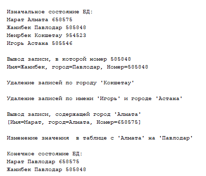

# BMK01_Lab03 Spring_Beans

Решение 3 лабараторной работы.<br/>
Вариант - 4 (БЛОКНОТ).<br/>
Реализация программы с использованием технологии Spring Framework и базы данных



```
CREATE TABLE IF NOT EXISTS `week` (
    `id` INT NOT NULL AUTO_INCREMENT,
    `name` VARCHAR(11) NULL DEFAULT NULL,
    `city` VARCHAR(45) NULL DEFAULT NULL,
    `num` VARCHAR(5) NULL DEFAULT NULL,
    PRIMARY KEY (`id`)
)  ENGINE=INNODB DEFAULT CHARSET=UTF8


SET GLOBAL time_zone = '+6:00';
```
